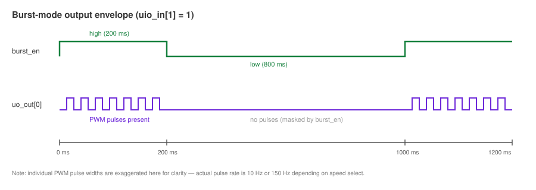
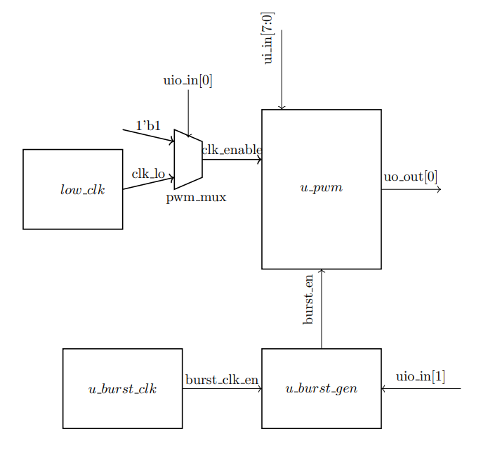

<!---

This file is used to generate your project datasheet. Please fill in the information below and delete any unused
sections.

You can also include images in this folder and reference them in the markdown. Each image must be less than
512 kb in size, and the combined size of all images must be less than 1 MB.
-->

## How it works

The module takes in a speed selection input and duty ratio then changes the frequency of the electrical impulses being generated. This project just demonstrates how a digital method can control the pulses through a PWM generator however in reality TENs devices are complicated and involve many more components outside of a digital pulse controller. Real TENs Devices are used on patients, this project has not been reviewed for safety and should not be used to directly send electrical impulses to skin. Input signals uio_in[0] and uio_in[1] are used to set the speed and mode of the pulses.

The PWM signal is outputted on the pin, uo_out. However selecting burst mode masks the pulse in an envelope  producing a burst of pulses for 200ms and pausing for 800ms.

### Input pins
|Pin name     | Description |
|-------------|-------------|
|ui_in[7:0]   |Sets the duty ratio of the PWM output|
|uio_in[0]    |Sets the speed. The pin can be assigned high or low. 1: High speed of 150Hz 0: Low speed of 10Hz|
|uio_in[1]    |Sets the mode. 1: Burst mode 0: Conitnuous mode|
|uio_in[7:2]  |Unused|

### Output Pins
|Pin name     | Description |
|-------------|-------------|
|uo_out[0]    |The PWM sgnal|
|uo_out[7:1]  |unused       |

### Modes of operation 
The mode of operation is set by asserting the input pin uio_in[1] high or low. The expected output can be seen in the diagram below: 

- Continuous mode:  The output the PWM signal is uninterrupted and pulses at the selected duty ratio and speed.
- Burst mode: The pulses occur once a second. The pulses should be on for 200ms and off for 800ms

  
                                                                 *Figure 1 : Output of burst mode*
To illustrate the working logic a simple block diagram is shown in Figure 2.
 

*Figure 2: Summative block diagram*

All module blocks shown in Figure 2 have clk signal from the main 38400Hz and the active low rst_n. The main system clock must be 38400Hz because the pwm output uo_out[0] doesn't complete a full cycle until the 8 bit counter overflows. The high speed of the TENs Device pulse should be 150Hz therefore the required clk frequency should equal 150*2^8 = 38400. 

## How to test

- Hold reset to return all signals to default
- Set the duty ratio inputs ui_in to a number between 0 -255
- First select the continuous mode leaving uio_in[1] as 0 for continuous mode and probe uo_out[0] pin, the output should be a continuous PWM pulse
- Turn on burst mode by asserting uio_in[1] and adjust the time base as necessary then view output on oscilloscope, the output should look like the output in Figure 1
- On burst mode the pulses should be present for 200ms and off for 800ms

## External hardware
The output of the design is a PWM signal so an oscilloscope is necessary to view the output on uo_out[0]

