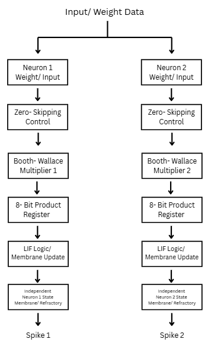

<!---

This file is used to generate your project datasheet. Please fill in the information below and delete any unused
sections.

You can also include images in this folder and reference them in the markdown. Each image must be less than
512 kb in size, and the combined size of all images must be less than 1 MB.
-->

## How it works

This LIF-Neuron are two neurons that coexsist on a single tile using spiking neural networking on a synchronus design as shown below.  

This is done by each neuron having its own hardware but with a shared input and weight data leading to ultimatly have its own spike.

This LIF-Neuron design uses a 8-bit `ui_in` bus for input data and the `uio_in` pins as control signals.

1. To load the lower 8 bits of the neuron input, place the value on `ui_in [7:0]` and set `uio_in [0]` high for one clock cycle

2. To load the upper 8 bits of the neuron input, place the value on `ui_in [7:0]` and set `uio_in [0]` high for one clock cycle

3. To write a weight, place the weight address on a `ui_in[7:4]` and the 4 bit wight on `ui_in[3:0]`. Setup `uio_in[2]` high to enable the write. 

4.  To read a wight, place the read address on `ui_in[3:0]` and set `uio_in[3]` high. 

5. To preform a neuron step, set `uio_in[4]` high. This will send the stored 16-bit input to the LIF neuron core. 

6. Use `uio_in[5]` to select the output neurons:
    - `0` selects neuron 1
    - `1` selects neuron 2

    the selected neurons output is provided on `uo_out`:

    - `uo_out[3:0]` = 4 bit membrane potential 
    - `uo_out[4]` = spike output
    - `uo_out[7:5]` = unused and set to 0

    * this design uses an active-low reset through `rst_n`

## How to test
This design is functionaly verified with Cocotb testbench that drives TinyTapeout pins and checks neuron outputs. 

If a test passes you should see 
TEST=1 PASS=1 FAIL=0

## External hardware

No external hardware is needed for this design. 
