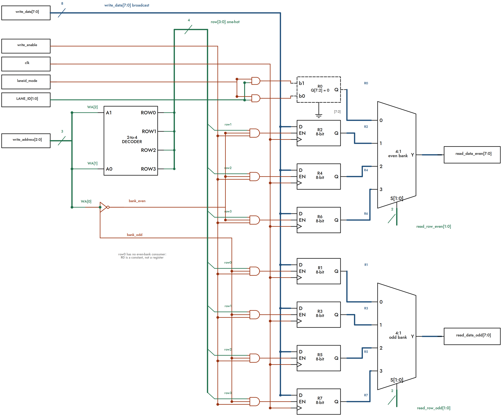
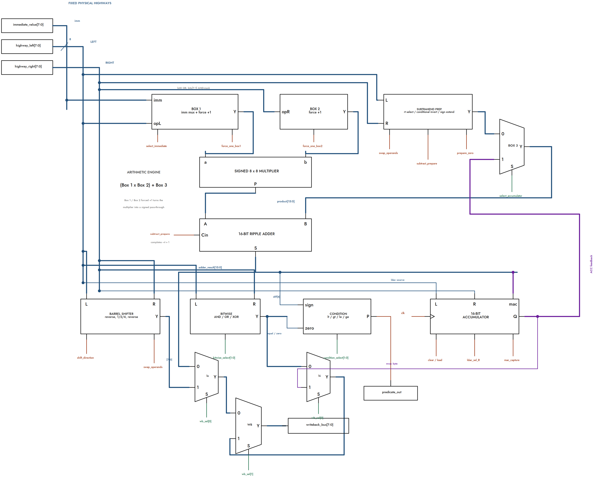
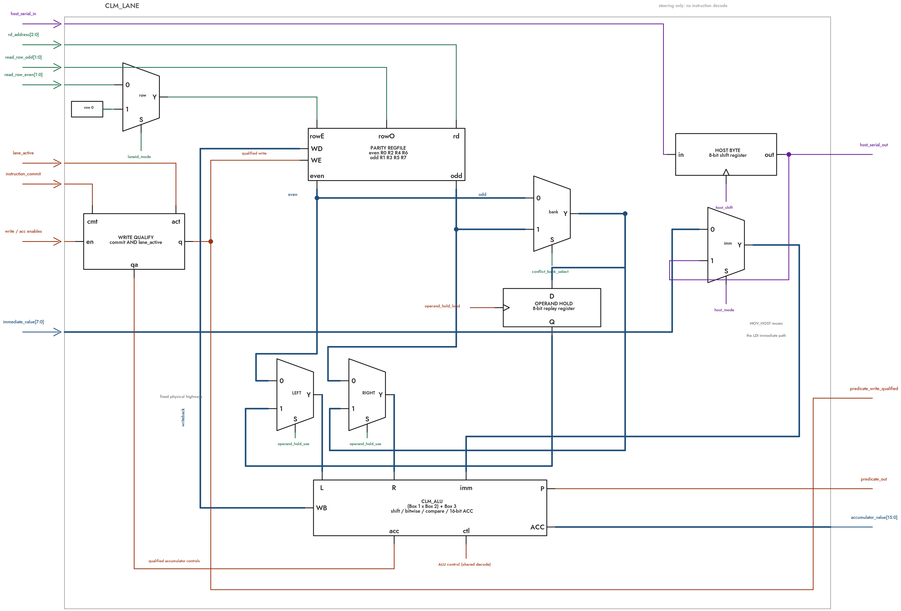
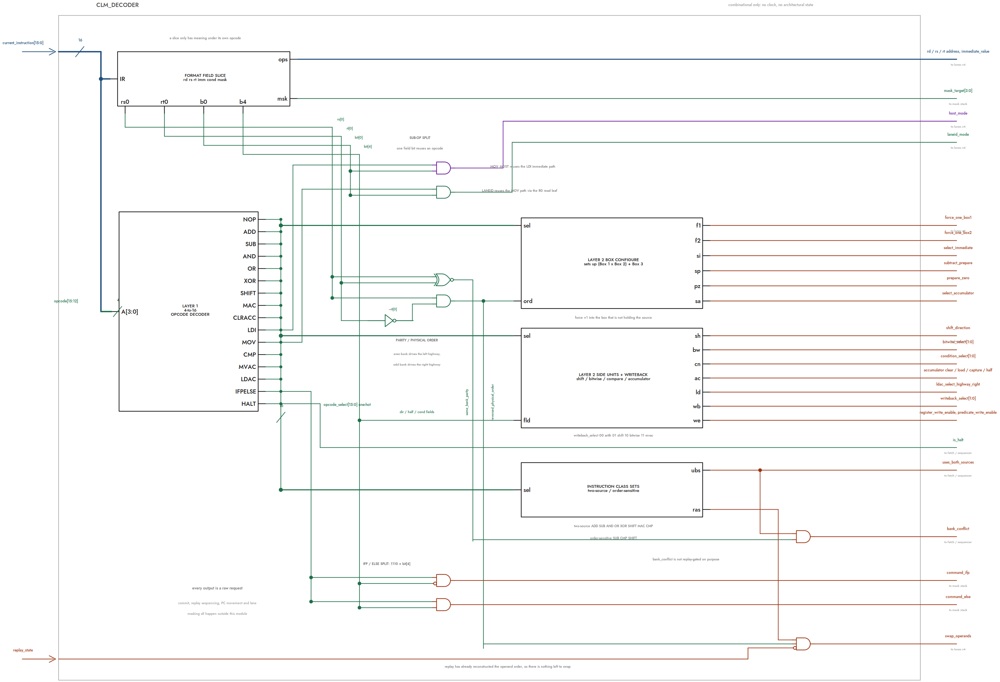
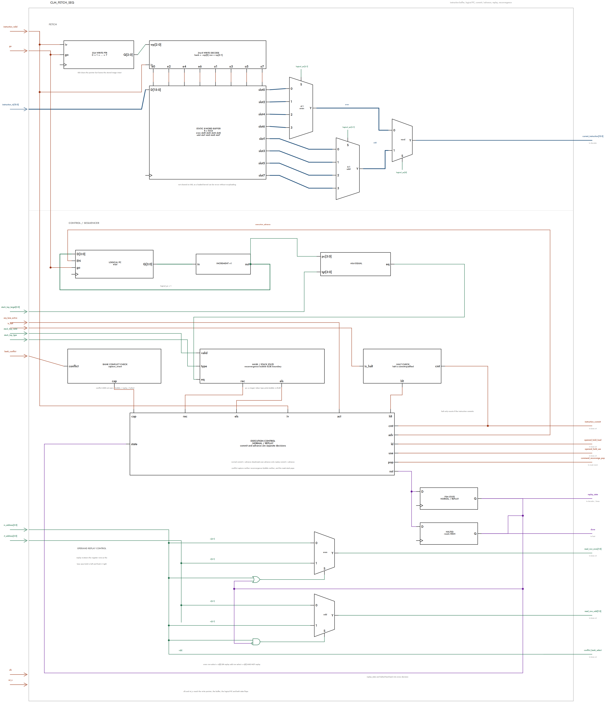
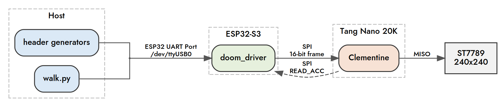

# Clementine Modules 

## `clm_mult_bw`: 8x8 Signed Multiplier

Baugh-Wooley -> Dadda -> RCA. Columns are 1-indexed, so Column $k$ holds weight $2^{k-1}$.

### Baugh-Wooley

* **The Problem:** Standard Verilog signed multiplication forces synthesis tools like Yosys to generate massive sign-extension networks and complex conditional logic to handle negative binary weights. Replicating this heavy conditional circuitry across all four parallel lanes would drastically inflate the chip's total cell count and ruin physical routing space.

* **The fix:** The Baugh-Wooley algorithm eliminates all conditional sign checks by strategically replacing specific edge bits with simple NAND gates and injecting two constant correction ones. This flattens the signed matrix into a uniform, unsigned addition problem that pipes directly into a compressor tree.

  ```
  positive terms + inverted sign-row/column terms + correction bits + sign*sign term
  ```

* **The 4 partial product cases** for an $n \times m$ multiplier ($n = m = 8$ here):

  | Case | Term | 8x8 | Gate |
  |---|---|---|---|
  | Standard body | $x_i y_j$, $\ 0 \le i \le n-2$, $0 \le j \le m-2$ | $x_0..x_6$ times $y_0..y_6$ | AND |
  | Multiplicand sign column | $x_{n-1}\overline{y_j}$, $\ 0 \le j \le m-2$ | $x_7$ times $y_0..y_6$ | AND, one input inverted |
  | Multiplier sign row | $\overline{x_i}\,y_{m-1}$, $\ 0 \le i \le n-2$ | $x_0..x_6$ times $y_7$ | AND, one input inverted |
  | Sign-bit corner | $x_{n-1}y_{m-1}$ | $x_7$ times $y_7$ | AND, left alone since $(-)(-) = +$ |

* **The correction bits:** the inversions overshoot, so 5 bits get added back. $\overline{x_{n-1}}$ and $\overline{y_{m-1}}$ land in column OutputWidth $- 2$, a single `1` lands in column OutputWidth $- 1$, and since $m = n$ the two leftover $x_{n-1}$, $y_{m-1}$ terms land in the same column, $P_{n-1}$:

  | Column | Weight | Bits |
  |---|---|---|
  | 8 | $2^7$ | $a_7,\ b_7$ |
  | 15 | $2^{14}$ | $\overline{a_7},\ \overline{b_7}$ |
  | 16 | $2^{15}$ | $1$ |

### Dadda

* Baugh-Wooley generates 64 one-bit partial products, which in Verilog are 64 wires. Dadda compresses those columns down using half adders (2 bits into 1) and full adders (3 bits into 1). Each adder also spits out a carry bit you MUST add to the next column, which raises that column's height.
* The formula is $D_{k+1} = \lfloor \frac{3}{2}D_k \rfloor$ with $D_1 = 2$ and $D < \min(N,M)$, where $D$ is the max column height allowed after a stage and $\min(N,M)$ is the max column height. So the sequence is $2, 3, 4, 6, 9, \dots$
* In our 8x8 the max column height is 8, so we start at $D = 6$.
* It sweeps LSB (Column 1) to MSB, then steps down the sequence and sweeps again, 6 -> 4 -> 3 -> 2. It STOPS at D = 2.

### RCA

* At $D = 2$ every column has height 2 except Column 1, so the whole thing is now just two rows to add.
* A ripple-carry adder compactly adds those two rows to produce the final 16-bit result.
* The tree cannot finish the job on its own, since a counter always emits a carry it can never get below two rows. The RCA is the only place carries actually propagate.

### The Issue

* Drop the 5 correction bits into the matrix as raw dots and Column 8 goes from height 8 to **10**.
* The largest Dadda level below 10 is 9, so the schedule turns into D = 9 -> 6 -> 4 -> 3 -> 2
* That is a whole extra stage on the tallest column, plus a correction row at the top for the $2^{14}$ and $2^{15}$ bits.
* More cells and more depth for zero benefit, which the area budget can't take.

### The Derivation

Start from the five correction bits:

$$C = (a_7+b_7)2^7 + (\overline{a_7}+\overline{b_7})2^{14} + 2^{15}$$

Since $\overline{a_7}+\overline{b_7} = 2 - a_7 - b_7$:

$$C = (a_7+b_7)2^7 + (2 - a_7 - b_7)2^{14} + 2^{15}$$

$$C = (a_7+b_7)2^7 - (a_7+b_7)2^{14} + 2^{16}$$

The product is 16 bits, so $2^{16}$ falls off the top:

$$\boxed{\;C = (a_7+b_7)\left(2^7 - 2^{14}\right) \pmod{2^{16}}\;}$$

So the 5 bits are not 5 independent corrections. Now define two control signals:

$$x = a_7 \oplus b_7 \quad(\text{one operand negative}), \qquad y = a_7 \wedge b_7 \quad(\text{both negative})$$

$$a_7 + b_7 = x + 2y$$

Substituting:

$$C = (x + 2y)\left(2^7 - 2^{14}\right)$$

$$\boxed{\;C = x2^7 + y2^8 - x2^{14} - y2^{15}\;}$$

5 correction bits become 2 reusable signals at 4 weights. Neither one is new hardware: $y$ is already `partial_product[7][7]`, and $x$ is the product-sign XOR. Column 9 is where $y$ goes because $x$ and $y$ are the sum and carry of $a_7 + b_7$, so the XOR stays in Column 8 and the AND is its carry into Column 9.

### Implementation

* **Low half ($+x$ at $2^7$, $+y$ at $2^8$):** don't put them in the initial matrix, that still forces $D = 9$. Instead feed them into half adders the $D = 6$ stage already places. Column 8's HA takes $x$ and becomes an FA, Column 9's HA takes $y$ and becomes an FA.
* A half adder and a full adder both output one sum and one carry, so the instance count doesn't change and the stage passes the same number of dots forward. The schedule stays 6 -> 4 -> 3 -> 2, no D = 9 and no correction row.

  ```verilog
  // ha to fa, including XOR*2^7      Column 8
  clm_fa d6_col7_fa1 (.a(pp[3][4]), .b(pp[4][3]), .cin(correction_xor), ...);

  // ha to fa, including AND*2^8      Column 9
  clm_fa d6_col8_fa1 (.a(pp[4][4]), .b(pp[5][3]), .cin(correction_and), ...);
  ```

* **Upper half ($-x$ at $2^{14}$, $-y$ at $2^{15}$):** it's a subtraction, so it belongs at the top of the RCA. At Column 15 the RCA subtracts $x$, and if that borrows, the borrow goes into Column 16 where $y$ is subtracted too. $y$ needs no borrow logic of its own since $2^{15}$ is the MSB and anything borrowed out of it gets discarded.

  ```verilog
  assign product[14]  = rca_sum14 ^ correction_xor;
  assign rca_borrow15 = (~rca_sum14) & correction_xor;
  assign product[15]  = rca_carry14 ^ rca_borrow15 ^ correction_and;
  ```

* $\overline{a_7}$, $\overline{b_7}$ and the constant `1` never exist as gates at all. Verified exhaustively over all 65,536 signed input pairs, zero mismatches in [tb_mult_bw.v](../test/individual/tb_mult_bw.v). 

## `clm_regfile`: Parity split register file



* Clementine has 8 architectural 8-bit registers per lane, with two source operands needed per instruction.

* A conventional dual-read register file would require two 8:1 read muxes, so the file is instead split into two parity banks:

  * Even bank: R0, R2, R4, R6
  * Odd bank: R1, R3, R5, R7

* `address[0]` selects the bank for free, while `address[2:1]` selects one of the four rows inside that bank. This reduces the read hardware to two 4:1 muxes.

* R0 is hardwired to zero rather than stored, saving 8 flip-flops.

  * Writes to R0 are ignored.
  * In `LANEID` mode, the R0 read position is reused to return the lane's ID instead of zero.

* The two read muxes are physically fixed to their banks:

  * Even-bank mux -> left highway
  * Odd-bank mux -> right highway

* They are not permanently `rs` and `rt` ports, and the two 8-bit highways are never swapped. The controller routes whichever operand is even to the even mux and whichever is odd to the odd mux.

* If `rs` and `rt` are in opposite banks, both operands are read in the same cycle with no stall.

* If both operands are in the same bank, the single mux cannot read both rows simultaneously, creating a one-cycle bank conflict:

  * Cycle 1 reads and captures one operand into an Operand-Hold Register.
  * Cycle 2 reads the second operand while the held operand is released alongside it.
  * The hold register is not programmer-visible. It only exists for conflict replay.

* Because the highways are parity-fixed, logical `rs` and `rt` can occasionally arrive in reversed physical positions. Clementine avoids an 8-bit crossbar by using reverse routing forms for non-commutative operations such as SUB, CMP, SHL, and SHR.

  * This changes only the internal routing.
  * The logical instruction result remains identical.

* Register writes use:

  * a destination address,
  * a write enable,
  * and the writeback data.

* Instructions with no GPR result, such as NOP, CMP, MAC, CLRACC, and LDAC leave the register file untouched.

## `clm_alu.v`: The three box weirdness


* Each Clementine lane is built around one shared arithmetic engine:

  **`(Box 1 x Box 2) + Box 3`**

* Box 1 and Box 2 feed the signed 8 x 8 multiplier.

  * Normally they carry register operands.
  * Either input can be forced to +1, allowing the multiplier to act as a sign-extending pass-through instead of actually multiplying.
  * Box 1 can also accept an immediate value.

* Box 3 supplies the 16-bit value added to the multiplier result.

  * It can contain a prepared arithmetic operand for ADD/SUB.
  * Or it can select the lane's 16-bit accumulator for MAC.

* This lets the same arithmetic hardware perform several instructions:

  * ADD: `rs x 1 + rt`
  * SUB: `rs x 1 + (~rt + 1)`
  * MOV: `rs x 1 + 0`
  * LDI: `imm x 1 + 0`
  * MAC: `rs x rt + accumulator`
  * CMP: performs the same subtraction path as SUB and evaluates the result.

* Register operands travel on fixed physical left/right highways. They are not physically swapped. When logical `rs` and `rt` arrive in reversed positions, control logic reroutes only the functions that care about operand ordering.

* The shifter operates alongside the arithmetic engine. One shared shift network performs both logical left and right shifts.

* AND, OR, and XOR are handled by a small parallel bitwise unit directly from the register highways.

* CM* reuses existing arithmetic and XOR hardware rather than having a dedicated comparator.

* Each lane contains a 16-bit accumulator used by MAC, CLRACC, LDAC, and MVAC.

* Arithmetic, shift, bitwise, and accumulator-read results converge at a small writeback selector, which chooses the value written back into the lane's register file.

* The overall design intentionally reuses the multiplier, adder, XOR network, and accumulator across many instructions to keep the lane small enough for Clementine's area-constrained SIMT architecture.


## `clm_lane`: Plumbing



* Each Clementine lane is a lightweight wrapper around:

  * one parity-banked register file
  * one 8-bit Operand-Hold register
  * one ALU / accumulator datapath

* The lane doesn't decode instructions itself. Shared control tells every lane which rows to read, which ALU operation to perform, whether the lane may write, and whether conflict replay is active.

* The register file exposes one even-bank value and one odd-bank value. During normal execution, the even-bank output feeds the left highway and the odd-bank output feeds the right highway. During conflict replay, the Operand-Hold path temporarily repurposes them into canonical logical order: held rs -> left, newly-read rt -> right.

* The lane is responsible for bank-conflict replay.

  * When both logical sources live in the same bank, the first value is captured into the lane-local Operand-Hold register.
  * Operand-Hold capture is deliberately not commit-gated, because the first operand has to be saved before the conflicting instruction can retire.
  * On the replay cycle, the second register is read and the held value is injected alongside it.
  * This reconstructs two operands without adding another full register-file read port.
  * `operand_hold` is real lane-local state. Synthesis shows one such register per physical lane. 

* The lane also handles the distinction between logical operands and the fixed physical highways*

  * Even-bank data always comes from one side.
  * Odd-bank data always comes from the other.
  * Reverse-routing control tells the ALU when logical `rs` and `rt` arrived in the opposite physical order.

* Register writeback also passes through the lane.

  * The ALU produces one 8-bit writeback value.
  * The lane combines that with the decoded destination address, write enable, current lane mask, and instruction commit before allowing the register file to change.

* The lane also qualifies all other lane-local side effects.

    * It forms a local lane_commit = instruction_commit & lane_active.
    * GPR writes, accumulator clears/loads/MAC captures, and CMP predicate writes only take effect when lane_commit is true.
    * This prevents inactive SIMT lanes from changing state even though every lane receives the same decoded control signals.

* Each lane has its own fixed LANE_ID (`0-3`).

  * LANEID reuses the register-file read path so software can observe which physical lane is executing without adding a separate general-purpose datapath.

* Each lane also participates in the MOV_HOST serial staging chain.

  * An 8-bit host byte is shifted through the physical lanes.
  * That lane-local byte can later replace the normal instruction immediate for MOV_HOST.
  * The staging path is separate from the architectural register file. The lane interface explicitly carries `host_mode`, `host_shift`, and `host_serial_in` alongside its normal datapath controls. 

* The ALU returns two important lane-local outputs:

  * predicate result, sent to the shared SIMT mask/divergence machinery
  * 16-bit accumulator value, exposed for host/SPI readback

* Most of `clm_lane` is therefore not computation. Its job is to steer data between the banked register file and ALU while hiding bank conflicts, preserving logical operand order, qualifying writes by lane activity, and connecting lane-specific features such as LANEID and MOV_HOST.

## `clm_decoder`: 2-Layer Combinational Translation Matrix



* Clementine uses one shared combinational decoder for the current 16-bit instruction.

  * It contains no architectural state and no clocked storage.
  * Its job is only to translate instruction meaning into control requests.
  * Commit, replay sequencing, PC movement, and lane masking happen elsewhere.

* The decoder is organized conceptually in 2 layers:

  * Layer 1: identify the 4-bit opcode.
  * Layer 2: combine that opcode with the relevant instruction fields to generate the required control signals.
  * This keeps the decoder essentially flat instead of building a deep chain of nested instruction-selection logic.

* Instruction fields are format-dependent.

  * The same physical bits may represent `rd`, `rs`, `rt`, an immediate, condition code, accumulator-half selector, direction bit, or mask target depending on the opcode.
  * The decoder only gives those fields meaning when the selected instruction actually uses them.

### Physical register awareness

* The decoder knows that Clementine's register file is parity banked.

  * `rs[0]` and `rt[0]` identify which physical bank each operand occupies.
  * Two-source instructions with equal parity raise `bank_conflict`.
  * even + odd -> no conflict, odd + even -> no conflict, even + even -> conflict, odd + odd  -> conflict

* The current decoder intentionally uses that simple rule for every genuine two-source instruction, including R0 and `rs == rt`.

* Only ADD, SUB, AND, OR, SHIFT, MAC, and CMP are considered two-source operations.

* This prevents immediate, single-source, accumulator, and control-flow instructions from generating meaningless register-bank stalls.

### Physical operand ordering

* The register highways themselves never swap, even bank going to the left highway and the odd bank going to the right highway

* Therefore, when rs even and rt is odd: rs arrives left and rt arrives right. When rs is odd and rt is even: rs arrives right and rt arrives left.

* The decoder recognizes the second case as reversed physical order.

* ADD, AND, OR, XOR, and MAC do not care which commutative operand arrives on which side.

* SUB, CMP, and SHIFT do care, so the decoder generates `swap_operands` when their logical operands arrive reversed.

* During a bank-conflict replay, `swap_operands` is suppressed because the lane's Operand-Hold/replay path has already reconstructed the operands into the required logical arrangement.

### Three-box ALU configuration

* The decoder does more than choose an ALU opcode. It configures the existing `(Box1 × Box2) + Box3` datapath to produce the required operation.

* It decides:

  * whether Box 1 is forced to +1
  * whether Box 2 is forced to +1
  * whether Box 1 receives an immediate
  * whether Box 3 receives the prepared arithmetic operand or accumulator
  * whether subtraction inversion / carry preparation is active

* This is how ADD, SUB, CMP, MOV, LDI, LANEID, and MAC share the same arithmetic engine rather than selecting separate arithmetic units.

### Side-unit control

* The decoder also configures the lane's parallel units:

  * SHIFT direction
  * AND / OR / XOR selection
  * LT / GT / LE / GE comparison selection
  * accumulator clear/load/MAC capture
  * accumulator high/low byte selection

* The lane's four register-producing paths are encoded directly for its balanced writeback tree:

```text
00 -> arithmetic
01 -> shift
10 -> bitwise
11 -> MVAC
```

* A separate `register_write_enable` determines whether that selected value actually modifies the register file.

* CMP instead requests a **predicate write**.

### ISA sub-operations

* Some opcode spaces are reused by a small sub-operation bit:

```text
1001 + bit[0]=0 -> LDI
1001 + bit[0]=1 -> MOV_HOST

1010 + bit[0]=0 -> MOV
1010 + bit[0]=1 -> LANEID

1110 + bit[4]=0 -> IFP
1110 + bit[4]=1 -> ELSE
```

* MOV_HOST reuses the LDI-style datapath, but tells each lane to use its staged host byte.

* LANEID reuses the MOV-style datapath, with the register file's virtual R0 read leaf supplying that lane's ID.

### Control-flow outputs

* The decoder recognizes IFP, ELSE, and HALT, but does **not** execute those actions itself.

```text
IFP / ELSE    -> mask-stack control
HALT          -> sequencer
bank conflict ->  sequencer replay logic
```

* These remain raw requests until the surrounding control logic decides that the current instruction is actually allowed to commit.

## `clm_fetch_seq`: Fetch + Sequencing


* `clm_fetch_seq` owns the instruction buffer, logical program counter, instruction commit/advance behavior, bank-conflict replay, dead-mask scanning, reconvergence handling, and HALT state.

* Clementine stores 8 instructions, each 16 bits wide, in a static instruction buffer.

* Instructions are loaded sequentially using `instruction_valid` and a 3-bit write pointer.

* The storage is physically split into even slots (0, 2, 4, 6) and odd slots (1, 3, 5, 7).

* `logical_pc[2:0]` selects the current instruction from those 8 slots, while the full 4-bit logical PC is used for control-flow target comparisons.

* GO starts execution of the currently loaded kernel.

  * It resets the logical PC to instruction 0.
  * It clears the halted state.
  * It returns the replay FSM to its normal state.
  * It resets the instruction write pointer to slot 0.
  * It doesn't erase the instruction buffer, so the same loaded kernel can be run again with another GO.

* The instruction buffer itself is not cleared on GO, so a previously loaded kernel can be run again without re-uploading it.

* A normal instruction both commits and advances the logical PC.

* A bank conflict turns one logical instruction into two physical cycles:

  * The first cycle holds the PC, suppresses commit, and captures the first source operand into the lane-local Operand-Hold register.
  * The replay cycle reads the second source, uses the held first operand, commits the instruction, and then advances the PC.

* During replay, the sequencer changes the register-row steering so the lane receives held `rs` on the left highway and newly-read `rt` on the right highway.

* If no lanes are active, the sequencer enters scan mode.

  * Ordinary instructions are skipped without committing.
  * The logical PC still advances so the machine can search for the next relevant control-flow boundary.

* If scan mode reaches an ELSE target, the ELSE instruction is allowed to commit even though no lanes are currently active. This allows the mask stack to activate the false-side lanes.

* If the logical PC reaches a reconvergence target, the sequencer inserts a one-cycle reconvergence bubble.

  * The instruction doesn't commit.
  * The PC doesn't advance.
  * The mask stack pops and restores the parent mask.
  * Execution resumes from the same instruction on the following cycle.

* `instruction_commit` and PC advance are intentionally separate concepts.

  * Normal execution: commit and advance.
  * Dead-mask scan: advance without commit.
  * Conflict capture: neither commit nor advance.
  * Replay: commit and advance.
  * Reconvergence bubble: neither commit nor advance.

* HALT is commit-qualified, so a HALT encountered inside an inactive region doesn't stop the machine.

* Once halted, `done` is asserted and the PC remains parked until GO or reset restarts execution.

* GO resets the logical PC and replay state, clears the halted state, and resets the instruction write pointer while leaving the stored instruction image intact.

## `clm_spi_host`: Just an oversampled SPI Slave

Clementine uses an oversampled SPI Mode 0 slave as its host interface. The SPI block loads instructions and per-lane data, starts kernels, reports execution status, and reads back each lane's 16-bit accumulator.

### Electrical interface

* Clementine does not use SCLK as an internal clock.
* Every flip-flop remains in the core clock domain. SCLK, CS, and MOSI enter asynchronously and are synchronized before being used.
* SCLK and CS use 3-stage synchronizers, while MOSI uses 2 stages.
* Edge detection compares settled synchronizer stages rather than the newest potentially-metastable sample.
* The FPGA implementation runs the core at approximately 40.5 MHz.
* SPI operates substantially slower, typically around 5-10 MHz.
* SPI is Mode 0, MSB first:

  * clock idles low
  * input is sampled on rising SCLK
  * MISO changes while SCLK is low
* CS is active low and frames every transaction. Consecutive instruction loads use separate CS-low frames.

| Signal  | Pin          | Purpose                      |
| ------- | ------------ | ---------------------------- |
| CS_N    | `uio[0]`     | SPI transaction framing      |
| MOSI    | `uio[1]`     | Serial input data            |
| MISO    | `uio[2]`     | Serial response data         |
| SCLK    | `uio[3]`     | SPI clock                    |
| Command | `ui_in[2:0]` | Selects the transaction type |

Only `uio[2]` is driven by Clementine; the remaining `uio` pins are inputs.

### Sideband command bus

* The SPI command does **not** travel over MOSI.
* A dedicated 3-bit command is presented on `ui_in[2:0]`.
* The host sets the command before pulling CS low and keeps it stable for the transaction.
* Internally, `command_latched` continuously tracks the command pins while CS is idle and freezes once CS becomes active.
* Because the command is already known before CS falls, STATUS and accumulator responses can be prepared immediately and returned in the same SPI frame.
* Freezing the command while CS is active also prevents command-pin glitches from changing the meaning of an in-progress transaction.

### Commands

| Command | Operation | Clocks | MOSI            | MISO               |
| ------- | --------- | -----: | --------------- | ------------------ |
| `000`   | EXEC      |     16 | one instruction | unused             |
| `001`   | GO        |     16 | ignored         | unused             |
| `010`   | STATUS    |     16 | ignored         | status word        |
| `011`   | BUFFER    | **32** | four lane bytes | unused             |
| `100`   | READ_ACC0 |     16 | ignored         | lane 0 accumulator |
| `101`   | READ_ACC1 |     16 | ignored         | lane 1 accumulator |
| `110`   | READ_ACC2 |     16 | ignored         | lane 2 accumulator |
| `111`   | READ_ACC3 |     16 | ignored         | lane 3 accumulator |

All commands use 16 SCLK cycles except BUFFER, which uses one uninterrupted 32-clock frame.

### EXEC

* EXEC loads one 16-bit instruction into Clementine's 8-entry instruction buffer.
* Each instruction is sent in its own 16-clock frame.
* Incoming MOSI bits are shifted into the SPI data register MSB first.
* When CS rises, `clm_spi_host` generates a one-core-cycle `instruction_valid` pulse.
* The fetch sequencer writes the completed 16-bit word into the next instruction slot and advances its write pointer.
* Up to eight instructions may be loaded into a kernel.

### GO

* GO starts execution of the currently loaded kernel from logical PC 0.
* The 16 MOSI data bits are ignored.
* When the GO frame ends, `clm_spi_host` produces a single-core-cycle `go` pulse for `clm_fetch_seq`.
* The sequencer uses GO to restart execution from the beginning of the kernel and clear its halted state.
* GO also resets the instruction write pointer to slot 0, so the next EXEC overwrites the program from the beginning.
* The instruction buffer itself survives GO, allowing a loaded kernel to be rerun without uploading it again.

In other words, the host-side start path is:

command `001` -> SPI frame completes -> `clm_spi_host` pulses GO -> `clm_fetch_seq` starts at PC 0

### STATUS

* STATUS returns the 16-bit status word during the **same SPI frame**.
* Bit 0 is `done`; all remaining bits are currently zero.
* `done = 0` means the sequencer is running.
* `done = 1` means execution has reached and committed a HALT instruction.
* Software normally polls STATUS after GO until bit 0 becomes 1 before reading results.

### BUFFER

* BUFFER provides four independent 8-bit host values, one for each physical lane.

* Unlike the other commands, BUFFER requires 32 SCLK cycles while CS remains low for the entire transfer.

* Each lane contains its own 8-bit host staging register.

* Together, the four staging registers form a physically distributed serial chain:

  MOSI -> lane 3 -> lane 2 -> lane 1 -> lane 0

* Because the first transmitted bits travel furthest through the chain, bytes are sent in the order lane 0, lane 1, lane 2, lane 3.

* The distributed chain avoids routing a centralized 32-bit host register across all four lanes.

* BUFFER shifting is enabled only while the BUFFER command is active, so it does not disturb the normal 16-bit SPI data register.

* Likewise, normal EXEC/GO/STATUS/READ_ACC transactions do not disturb the lane host bytes.

* A later MOV_HOST instruction causes each active lane to use its own staged byte in place of the normal instruction immediate.

* Host staging persists until another BUFFER transaction replaces it, so one loaded buffer can be reused by multiple MOV_HOST instructions.

* MOV_HOST still obeys the SIMT lane mask; inactive lanes do not write their architectural registers.

### READ_ACC

* Commands `100-111` select one of the four physical lane accumulators.
* The selected lane's complete 16-bit accumulator is returned over MISO during the same frame.
* The low two command bits select lanes 0 through 3.
* These commands are normally issued after STATUS reports that execution has halted.

### Shared SPI data register

* A single 16-bit `data_register` is reused for both receive and response shifting.
* Clementine does not contain separate 16-bit receive and transmit buffers.
* At CS-fall, read transactions preload `data_register` with the selected STATUS or accumulator response.
* During ordinary non-BUFFER transactions, MOSI bits shift into the register on detected rising SCLK edges.
* BUFFER bypasses this path and shifts directly through the four lane-local host staging registers.
* There is no SPI bit counter. CS defines the transaction boundary, and the host is responsible for supplying exactly 16 clocks for ordinary commands or 32 clocks for BUFFER.

The read response is produced with a one-hot AND/OR structure. Each accumulator is enabled only when its corresponding lane command is selected, while STATUS contributes only its `done` bit. This avoids a conventional wide lane-selection mux and synthesized substantially better for Clementine's routing constraints.

### MISO timing

* MISO is driven by a dedicated output flip-flop rather than directly from `data_register[15]`.
* At CS-fall, the response MSB is loaded into the MISO flop before the first sample.
* While SCLK is low, MISO is updated from the current MSB of `data_register`.
* While SCLK is high, MISO remains unchanged.
* This gives each response bit the low half of the SPI period to settle before the Mode 0 master samples it on the next rising edge.

This behavior was introduced after FPGA bring-up exposed a timing bug in the original implementation. MISO had previously been driven directly from the shift register, which also changed in response to the master's rising edge. The ESP32 sampled late enough that it sometimes observed the newly shifted value instead of the intended bit, making returned words appear shifted left by one position.

The dedicated output flop ensures MISO remains stable across the master's sampling edge.

MISO has no architecturally meaningful value during EXEC, GO, or BUFFER transactions.

## Programming Clementine

A normal host sequence is:

1. BUFFER - optional. load four independent per-lane bytes if the kernel uses MOV_HOST.
2. EXEC x N - load up to eight 16-bit instructions, one instruction per SPI frame.
3. GO - start the loaded kernel from instruction 0.
4. STATUS - poll until bit 0 (`done`) becomes 1.
5. READ_ACC0-READ_ACC3 - retrieve the four lane accumulator results.
6. Issue another GO to rerun the same cached kernel, or begin sending EXEC frames to replace it with a new program.

Architectural state persists between runs. General-purpose registers, accumulators, host staging bytes, and the instruction buffer are not erased simply by issuing GO.


## `tt_um_bigmanraffa_clm`: Top-Level Integration (plumbing)

* `tt_um_bigmanraffa_clm` is primarily Clementine's structural integration layer. It connects the major architectural blocks rather than implementing another datapath of its own.

* The top level instantiates:

  * one shared instruction decoder
  * one fetch/sequencing unit
  * one SIMT mask stack
  * one SPI host interface
  * four physical execution lanes

* The decoder and fetch sequencer generate shared control that is broadcast to all four lanes, keeping them in lockstep.

* Each lane returns its predicate result to the shared mask/divergence machinery and exposes its 16-bit accumulator to the SPI host for readback.

* The four lane-active bits are reduced into `any_lane_active`, which lets the fetch sequencer distinguish normal execution from an all-inactive region that must be scanned.

* GO is distributed through the top-level control path so a new run restarts both instruction sequencing and the SIMT execution mask.

* The top module also connects the TinyTapeout external pins to the SPI host and exposes the small set of external/debug outputs used to observe the core.

* In other words, the top level mostly defines how Clementine's shared control plane and four replicated execution lanes are wired together. Instruction semantics, sequencing, divergence, arithmetic, and host protocol behavior belong to their respective child modules.

# Post Silicon

##  `assembler.c`: Combined assembler + loader

- Reads the kernel file a line at a time, and cuts everything after a // in case the individual would like to comment their kernels. It then breaks the line into pieces on spaces and commas, so MAC R1, R2 and MAC R1 R2 parse identically. The first piece is the mnemonic, and up to three more are its operands.

- To get different data into each lane, the assembler has one non-instruction line, the .host directive. It takes four comma-separated bytes and holds them aside as the staging payload rather than encoding them into the program, so they can be sent over SPI as a BUFFER frame before the kernel runs and picked up later by MOV_HOST. Anything other than exactly four values is an error, since there are four lanes and the staging chain expects a full 32-bit frame.

- Each mnemonic is looked up in a static table where every entry carries a name, an opcode, an operand format, and a variant bit. The format tells the encoder which operands to expect, three registers, a register and an immediate, a condition code, or nothing at all. The variant bit is what lets one opcode serve two instructions, since LDI and MOV_HOST both encode as 1001 and differ only in bit 0, as do MOV and LANEID with 1010.

- The whole program is built into a list before any machine code is emitted, because divergence instructions point forward and the assembler cannot know their destinations on the first pass. A second pass fills those in: IFP writes the slot number of its matching ELSE into its own low four bits, and ELSE writes the slot of the ENDIF into its. ENDIF never becomes an instruction. It exists only to mark where the lanes reconverge, which is why the ISA has no ENDIF opcode.

- Counts slots and rejects any kernel past eight, the depth of the chip's instruction buffer.

- Checks bank parity on every two-source instruction and warns when both registers are odd or both even, since that triggers the operand-hold replay path and costs a cycle.

- Opens the serial device with termios in raw mode at 115200 baud, clearing canonical processing, echo, and input translation so bytes pass through untouched.

- Frames every command as a 0xA5 sync byte, a length, the opcode, the payload, and a checksum XORing the length, opcode, and payload together. The reply is six bytes with a 0x5A sync, a status, a length, two data bytes, and its own checksum, all verified before the value is accepted.

- The opcode rides in the packet header rather than the payload, because on the chip side it never travels over SPI. The bridge writes it to the three command pins before dropping chip select.

- Runs a fixed sequence: one BUFFER packet if the kernel had a .host, one EXEC packet per instruction word, GO, then STATUS in a loop up to a hundred times checking bit 0, then one READ_ACC per lane.

- Prints the assembled listing with slot numbers and hex encodings, then the four lane results as hex, unsigned, and signed.

## `UART-to-SPI.ino`: A passthrough


- The assembler sends one command per packet over `/dev/ttyUSB0`: a `0xA5` sync byte, a length, the opcode, the payload, and a checksum XORing the first three together.

- Incoming bytes are discarded until a `0xA5` arrives, so a partial packet cannot be read as the start of a real one. After the sync it reads the length, opcode, that many payload bytes, and the checksum, with a 200 ms timeout on each byte.

- Validation happens before the SPI bus is driven. The checksum is recomputed and compared, opcodes above 7 are rejected since the chip has eight commands, and the payload length is checked against what the opcode expects: two bytes for everything except BUFFER, which needs four. A failure returns an error status without touching the chip.

- The opcode does not travel over SPI. Its three bits are written individually to GPIO 4, 5, and 6, hardwired to Clementine's `ui_in[2:0]`, followed by a 2 µs settle. The chip's command latch tracks those pins while chip select is idle and freezes when it goes active, so they must be stable before the frame begins.

- Chip select drops, and after 50 us the payload is clocked out one byte at a time. Two bytes makes a 16-bit frame, four makes the 32-bit BUFFER frame, so the UART payload length sets the SPI frame length.

- An EXEC frame carries one 16-bit instruction word, which Clementine stores in one of eight slots rather than running it. A GO frame executes those slots in order across all four lanes, and each lane's arithmetic accumulates into its own 16-bit accumulator. A BUFFER frame carries no instruction at all: its 32 bits shift down a chain into the lanes, one byte each, for a later MOV_HOST to read.

- SPI is full duplex, so each `SPI.transfer` shifts a byte out on MOSI and captures a byte in from MISO on the same clock edges. The bridge overwrites each payload byte with the byte it captured. For EXEC and GO that data is meaningless. For STATUS it is the done bit, and for READ_ACC it is the selected lane's accumulator.

- Chip select rises after a final 1 us. Clementine advances its write pointer on that rising edge for EXEC and asserts `go` on it for GO, so the transaction completes on the rise rather than the fall.

- The two captured bytes are packed into a 16-bit value and returned as six bytes: a `0x5A` sync, a status code, a length, the high and low bytes, and a checksum over the last four. The assembler verifies all of it before accepting the value as an accumulator reading.

## `doom_driver`: Host driver and geometry pipeline



* The ESP32 is not the renderer. It decides what is visible, hands Clementine the numbers, and paints what comes back.

* Since DOOM's map format is built for a machine with 32-bit registers and a divide instruction, the WAD has to be preprocessed into something Clementine can consume. Three generators do that at build time.

  * A DOOM level is a soup of line definitions, and the engine splits them into wall segments using a binary space partition tree, which is a precomputed decision tree that tells you from any point which walls sit in front of which. E1M1 has 732 segments and 236 tree nodes, and all of it gets emitted as C arrays.
  * A wall segment only names a line and which side of it you are standing on, so finding out how tall the room is takes three hops: line, then side definition, then sector, which is where floor and ceiling heights actually live. Done once at build time. E1M1 has 23 distinct room heights from 56 to 296 units, and without them every wall renders at the same height and the level looks like one long corridor.
  * There is no sine instruction and no floating point, so a 256-entry sine table is generated in Q0.7, meaning the value is stored as an integer scaled by 128. Cosine is the same table read 64 entries along, so only one table exists.
  * The pistol and status bar are pulled out of the WAD and converted to the panel's 16-bit colour format. DOOM stores images column by column with a per-column offset table and run-length encoded vertical strips, so the generator walks that structure and flattens it.

### Coordinates that fit in a byte

* Clementine's registers are 8 bits and E1M1 spans several thousand map units, so world coordinates do not fit. Dividing everything down by a constant destroys the level: shifting global coordinates far enough to reach int8 collapses 72 of 302 walls to zero length.

* The PlayStation had the same problem with its fixed-point coordinate system and solved it by storing vertices relative to the object they belong to rather than to the world. I store every wall segment relative to its own subsector's origin.

  * Local coordinates peak at 52, which is 41% of a signed byte, with all 732 segments intact.
  * It also bounds the side test at 2,122 instead of 43,657, so intermediate results stay inside the 16-bit accumulator and the host never has to rescue an overflow into 32-bit arithmetic.
  * The parser pre-bakes the wall normals and plane distances too, so the firmware reads finished values instead of deriving them every frame.
  * Depth comes out of the rotation as roughly the world distance times 127/8, since the coordinate is scaled by the sine table's 127 and then shifted back by the subsector scale. That factor is baked into the constant that converts a world height into a screen row.

### Dividing without a divider

* Clementine has no divide instruction, only a multiplier, so division becomes multiplication by a reciprocal.

  * On the ISA that is two instructions: a MAC, then taking the high half of the accumulator, which is the shift by eight.

  * The result comes back in Q4, meaning the integer holds the value times 16, so the top bits are which cell row the edge lands in and the bottom four are how far into that cell it falls.

* A single fixed reciprocal scale fails at both ends of the range, so both operands are shifted into [64,127] before the multiply.

  * 7.6% of hits had a numerator too large for an 8-bit register, and 7.4% had the reciprocal round to zero and silently report a wall at zero distance.
  * Normalising makes the product bound of 127 x 127 = 16129 a proof rather than a measurement, and takes the failure rate from 15% to 0.024%.
  * The shift count is a leading-zero count on the host, not arithmetic. Clementine has no CLZ, so the host finds how far to shift, the chip multiplies, and the host shifts the answer back.

* The shift back is `9 + f - e` where `e` and `f` are the two normalisation shifts, since the reciprocal is about `2^13/d8` and Q4 output wants `2^4`.

### Deciding what is visible

* The tree walk goes front to back, nearest child first, so the first thing to write a screen column wins and everything behind it is rejected. That is where occlusion comes from, and it is why there is no depth buffer anywhere in the renderer.

  * Which child is nearer is a side test against the node's partition line. It runs in 32-bit on the host because the intermediate reaches about 1.2 million, well past what the chip's accumulator holds.
  * Walls facing away from the camera are rejected before a single transaction is spent on them.
  * Once every column is sealed the walk stops entirely rather than finishing the tree.

* A wall's endpoints are scaled from subsector-local into camera-relative bytes by picking the shift that keeps the largest coordinate under 128. Anything needing more than four extra bits of shift is too far to matter and gets dropped.

* Only two multiplies in the whole frame stay on the host, and both are visibility tests rather than rendering: the side test that steers the tree walk, and the backface reject.

### Splitting operands by who needs what

* For a given wall, the rotation constants are identical in all four lanes. Only the endpoint coordinates differ.

  * The identical values arrive as immediates baked into the instruction word.
  * The per-lane values arrive through the staging buffer, which shifts bytes down a chain so each lane ends up holding its own.
  * The register pressure only stays survivable because of this split.

* Registers and the accumulator survive a kernel launch, so a sequence of small kernels carries state between runs and the eight-instruction buffer stops being a hard ceiling.

  * The camera rotation depends on this directly. Its second launch has no accumulator clear and simply adds onto the first.
  * The rotation constants are the same for a whole frame, so they load once and every wall after that reuses them.
  * Two walls are rotated at once across the four lanes, which is legal because subsectors are convex and walls inside one can never occlude each other.

* Every multiply pairs an odd-numbered register with an even-numbered one, because the register file is split into parity banks and two operands from the same bank cost a replay cycle. The sine value is deliberately duplicated into both an odd and an even register to make that work out.

* The reciprocal used to be an immediate, which broadcasts one value to all four lanes and forced a single divide per launch. Staging it per-lane instead means four independent divides with four different denominators run together.

### What the chip decides about the picture

* The perspective divide returns four fractional bits below the cell grid, and the original code threw them away by rounding to the nearest cell.

  * That fraction is how far into a cell the wall edge actually falls, which is coverage, and coverage is the defining output of a rasterizer.
  * Reading those bits and picking a glyph filled to a quarter, half, three quarters or full takes vertical edge resolution from eight pixels down to two.
  * This stops a wall receding into the distance from looking like a staircase and more like a line.

* A wall crossing the plane of the camera has one endpoint at almost zero distance, and dividing by that produces a span thousands of columns wide. Clipping that endpoint to a fixed minimum distance in front of the eye fixes it.

* Each screen column tracks a ceiling and floor bound rather than a single wall height.

  * A solid wall fills the window and seals the column.
  * A doorway fills only the band where the ceiling steps down or the floor steps up, then hands the narrowed window to whatever is behind it. Of E1M1's 389 two-sided lines, 115 have an upper band, 115 a lower, and 206 are open gaps you see straight through.

### Getting pixels to the glass

* The accumulator is 16 bits wide and the panel's colour format is 16 bits, so a colour goes from chip to glass with no repackaging. One accumulator read is exactly one pixel.

* The panel's data line sits on Clementine's output, and the ESP32 supplies only clock and chip selects, so there is no second data path. Every byte the display receives has been shifted out of the accumulator.

* The screen is a 30 by 30 grid of cells compared against the previous frame, and only runs of changed cells are sent.

  * Walking makes a wall grow at both ends while its middle stays identical, so splitting each column into separate runs rather than one span cut pixels pushed while walking from 33,560 to 11,260.
  * A window setup costs about 36 transactions and a cell costs 64 pixels, so merging across even one unchanged cell loses. Splitting on any clean cell is optimal.
  * The column address only changes once per column, so it is set once rather than per run.

* Ceiling and floor were originally dithered patterns, which meant the colour flipped on nearly every pixel and each flip reloads the accumulator. A dithered cell cost 107 transactions against 23 for a solid one, so both became flat colours separated by hue alone.

* The status bar and the solid part of the pistol are drawn once at startup and then marked off-limits, so the renderer never repaints them. The pistol's transparent edges are classified per cell at build time, and only the mixed cells composite over the live view each frame.