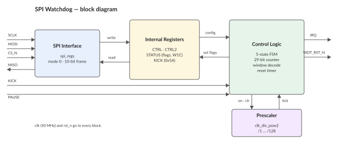
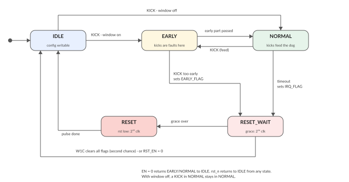
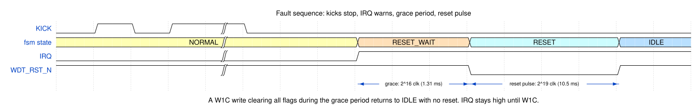

<!---
This file is used to generate your project datasheet. Please fill in the
information below and delete any unused sections.
-->

## How it works

A watchdog timer for an external MCU, configured over SPI.

The MCU sets a timeout, then feeds ("kicks") the watchdog periodically, by an
SPI write or by a rising edge on a dedicated pin. If the kicks stop, the
watchdog raises `IRQ` as a warning. If the MCU still does not react, the
watchdog pulls the `WDT_RST_N` pin low to reset the MCU.

Main features:

- Eight timeouts from 5.24 ms to 5.37 s (at 50 MHz), and a prescaler that
  stretches them by up to 128x.
- Window mode: a kick that comes **too early** is treated as a fault. This
  catches firmware stuck in a loop that kicks faster than it should.
- Two-stage response: first an `IRQ` warning with a 1.3 ms grace period,
  then a 10.5 ms active-low reset pulse. During the grace period the MCU
  gets one last chance to cancel the reset (see "Second chance" below).
- After a watchdog reset, the MCU can read back **why** it was reset: the
  fault flags survive the reset pulse.
- A `LOCK` bit freezes the configuration, so software cannot switch the
  watchdog off until the next hardware reset.
- The FSM state is visible on three output pins, which makes silicon
  bring-up easier.



## How to test

### Interface

| Signal       | Dir | Description                                                    |
| ------------ | --- | -------------------------------------------------------------- |
| `ui_in[0]`   | In  | `SCLK` — SPI clock from the master                              |
| `ui_in[1]`   | In  | `MOSI` — SPI data in (master -> this chip)                      |
| `ui_in[2]`   | In  | `CS_N` — SPI chip select, active low                            |
| `ui_in[3]`   | In  | `PAUSE` — freeze the watchdog window while high                 |
| `ui_in[4]`   | In  | `KICK` — feed the dog on a rising edge                          |
| `ui_in[7:5]` | In  | Unused                                                          |
| `uo_out[0]`  | Out | `MISO` — SPI data out (this chip -> master)                     |
| `uo_out[1]`  | Out | `IRQ` — fault interrupt, active high                            |
| `uo_out[2]`  | Out | `WDT_RST_N` — reset output, active LOW. Idles high              |
| `uo_out[5:3]`| Out | `STATE` — current FSM state, for debug (encoding below)         |
| `uo_out[7:6]`| Out | Unused, driven low                                              |
| `uio[7:0]`   | —   | Unused                                                          |
| `clk`        | In  | System clock. Timings below assume 50 MHz                       |
| `rst_n`      | In  | Active low synchronous reset                                    |

`rst_n` clears everything: registers, counters, flags, `MISO` and `IRQ`.
`WDT_RST_N` idles high, also during and right after `rst_n`, so the MCU is
not reset by accident at power-up.

### SPI frame

SPI mode 0 (CPOL=0, CPHA=0). MOSI is sampled on the rising edge of `SCLK`,
MISO changes on the falling edge. A frame is 10 bits, MSB first, and is only
valid while `CS_N` is low:

```
  bit   9    8  7    6  5  4  3  2  1  0
       [R/W][ ADDR ][       DATA       ]
```

- `R/W` — 1 = read, 0 = write
- `ADDR` — 2-bit register address
- `DATA` — 7 bits. On a write, the value to store. On a read, MOSI is
  ignored and the register value comes back on MISO in these 7 bit
  positions; MISO is 0 during the `R/W` and `ADDR` bits.

`SCLK` is not used as a real clock. It is sampled by `clk`, so each `SCLK`
level must be held for at least two `clk` periods. Keep `SCLK` at or below
about `clk / 4` (12 MHz at 50 MHz; 5–10 MHz is safer). `CS_N` must be stable
for a few `clk` periods before the first and after the last `SCLK` edge.

A frame takes effect only if exactly 10 bits were clocked in while `CS_N`
was low. Frames of any other length are discarded.


### SPI register map

| Addr | Name     | R/W   | Description                                        |
| ---- | -------- | ----- | -------------------------------------------------- |
| 0    | `CTRL`   | RW    | Enable, interrupt enable, timeout and window       |
| 1    | `KICK`   | W     | Write `0x5A` to feed the dog. Other values ignored |
| 2    | `STATUS` | R/W1C | Status flags, write 1 to clear                     |
| 3    | `CTRL2`  | RW    | Prescaler and reset enable                         |

`KICK` is write-only and reads back 0.

#### `CTRL` (addr 0)

| Bit | Name      | Reset | Description                                      |
| --- | --------- | ----- | ------------------------------------------------ |
| 0   | `EN`      | 0     | 1 = watchdog armed. Writing 0 stops it at once   |
| 1   | `IRQ_EN`  | 0     | 1 = flags are allowed to drive the `IRQ` pin     |
| 4:2 | `TIMEOUT` | 000   | Timeout selection, see table                     |
| 6:5 | `WINDOW`  | 00    | Early-window selection, see table                |

| `TIMEOUT` | Clocks | Timeout @ 50 MHz |
| --------- | ------ | ---------------- |
| 000       | 2^18   | 5.24 ms          |
| 001       | 2^19   | 10.5 ms          |
| 010       | 2^20   | 21.0 ms          |
| 011       | 2^21   | 41.9 ms          |
| 100       | 2^22   | 83.9 ms          |
| 101       | 2^24   | 336 ms           |
| 110       | 2^26   | 1.34 s           |
| 111       | 2^28   | 5.37 s           |

The low selections step by one exponent for fine control; the top three step
by two so the range reaches ~5 s. Every `PRESCALER` step doubles all times.

`WINDOW` sets how much of the start of each timeout window is the "early"
part. A `KICK` inside the early part is a fault.

| `WINDOW` | Early part    | Meaning                              |
| -------- | ------------- | ------------------------------------ |
| 00       | None          | Disabled: any `KICK` feeds the dog   |
| 01       | First `T`/2   | A `KICK` in the first half is early  |
| 10       | First `T`/4   | A `KICK` in the first quarter is early |
| 11       | First `T`/8   | A `KICK` in the first eighth is early |

`T` is the timeout selected by `TIMEOUT`.

#### `STATUS` (addr 2)

| Bit | Name         | R/W | Description                                     |
| --- | ------------ | --- | ----------------------------------------------- |
| 0   | `IRQ_FLAG`   | W1C | A timeout happened                              |
| 1   | `ARMED`      | R   | 1 = a window is running. Read-only              |
| 2   | `EARLY_FLAG` | W1C | A `KICK` arrived inside the early part          |

Both flags are sticky: only a W1C write or `rst_n` clears them. A `KICK`
does not. Both drive the `IRQ` pin, so reading `STATUS` tells a timeout
apart from an early kick. The flags also survive the `WDT_RST_N` pulse, so
after a watchdog reset the MCU can read why it was reset.

#### `CTRL2` (addr 3)

| Bit | Name        | Reset | Description                                   |
| --- | ----------- | ----- | --------------------------------------------- |
| 2:0 | `PRESCALER` | 000   | Window clock divider, /1 .. /128 (2^value)    |
| 3   | `RST_EN`    | 0     | 1 = a fault leads to a `WDT_RST_N` pulse      |
| 4   | `LOCK`      | 0     | 1 = freeze `CTRL` and `CTRL2` until `rst_n`   |
| 6:5 | —           | 00    | Unimplemented, reads as 0                     |

`PRESCALER` divides the clock that feeds the window counter, so it scales
every `TIMEOUT` setting by the same factor (up to 687 s at /128). It does
NOT change the grace period or the reset pulse width. With `RST_EN` = 0 the
watchdog is IRQ-only: a fault raises `IRQ` but never pulses `WDT_RST_N`.

`LOCK` turns this into a watchdog that software cannot switch off. Once
set, every write to `CTRL` and `CTRL2` is ignored — including `EN` = 0 —
until the next `rst_n`. A fault still returns the FSM to `IDLE` with `EN`
still 1, so the next `KICK` re-arms the dog. `LOCK` only takes effect while
`EN` is already 1: a locked, disarmed watchdog could never be started
again, so such a write is refused. The W1C second chance (below) still
works while locked.

### Watchdog behavior



| State        | Meaning                              | Length                       |
| ------------ | ------------------------------------ | ---------------------------- |
| `IDLE`       | Not counting. Config is writable     | until `KICK` with `EN` = 1   |
| `EARLY`      | Window running, kicks are early here | first part of `T` (`WINDOW`) |
| `NORMAL`     | Window running, kicks feed the dog   | rest of `T`                  |
| `RESET_WAIT` | Fault declared, grace period         | 2^16 clocks (1.31 ms)    |
| `RESET`      | `WDT_RST_N` driven low               | 2^19 clocks (10.5 ms)    |

Writing `EN` = 0 returns to `IDLE` at once from `EARLY` or `NORMAL`
(ignored while `LOCK` is set). `rst_n` returns to `IDLE` from any state,
including `RESET`.

The current state is visible on `uo_out[5:3]` (`IDLE` = 0, `EARLY` = 1,
`NORMAL` = 2, `RESET_WAIT` = 3, `RESET` = 4), so on real hardware a scope
on these pins shows where the machine is without any SPI traffic.

#### Kick

A `KICK` event is a rising edge on the `KICK` pin (synchronised, edge
detected) or an SPI write of `0x5A` to the `KICK` register.

| State                | Effect of `KICK`                                  |
| -------------------- | ------------------------------------------------- |
| `IDLE`, `EN` = 1     | Arms: starts a fresh window                       |
| `IDLE`, `EN` = 0     | Ignored                                           |
| `EARLY`              | Fault: sets `EARLY_FLAG`, goes to `RESET_WAIT`    |
| `NORMAL`             | Feeds: restarts the window (at `EARLY` if on)     |
| `RESET_WAIT`/`RESET` | Ignored — a kick cannot cancel a declared fault   |

The first `KICK` out of `IDLE` is never early. If `KICK` and the timeout
happen on the same clock, the `KICK` wins.

#### Fault path and the second chance

A fault (timeout, or early kick) raises the flag, asserts `IRQ` (if
`IRQ_EN`), and enters `RESET_WAIT`:



1. **`RESET_WAIT`** — a fixed grace period of 2^16 clocks (1.31 ms at
   50 MHz). `WDT_RST_N` is still high. During this time the MCU may cancel
   the reset by clearing **all** set flags with one W1C write to `STATUS`
   (e.g. write `0x05`). If it does, the machine returns to `IDLE` and no
   reset happens. This must be a deliberate SPI write — a `KICK` does not
   work, so runaway code that still kicks cannot save itself. With
   `RST_EN` = 0 the machine goes straight back to `IDLE`.
2. **`RESET`** — if the grace period expires, `WDT_RST_N` goes low for
   2^19 clocks (10.5 ms). This pulse cannot be stopped (only by
   `rst_n`). Then the machine returns to `IDLE`.

Both lengths are fixed in `clk` cycles: the prescaler and `PAUSE` have no
effect on them. To use the second chance, run with `IRQ_EN` = 1 and clear
the flags inside the `IRQ` handler.

After the fault the watchdog sits in `IDLE` disarmed-by-event: `EN` is
still 1, and the next `KICK` starts a fresh, full-length window.

#### Configuration locking

`CTRL` (except `EN`) and `CTRL2` are writable only in `IDLE`. While a window
is running, a `CTRL` write updates `EN` alone, and a `CTRL2` write is
discarded. To reconfigure: write `EN` = 0, write the new settings, write
`EN` = 1, then `KICK`.

With `LOCK` set, both registers are frozen entirely and reconfiguring is
impossible until `rst_n`. The intended arming sequence for a locked
watchdog is: write `CTRL` with the final settings and `EN` = 1, write
`CTRL2` with the final settings and `LOCK` = 1, then `KICK`.

#### `PAUSE`

`PAUSE` (`ui_in[3]`) high freezes the window: the counter and the prescaler
hold their values, and continue where they stopped when `PAUSE` drops.
`KICK` still works during `PAUSE` (a feed clears the counter). `PAUSE` does
not stretch the grace period or the reset pulse, and SPI access is
unaffected.

## External hardware

- Connect `WDT_RST_N` (`uo_out[2]`) to the MCU's active-low reset input.
- Connect `IRQ` (`uo_out[1]`) to an MCU interrupt pin (optional, but needed
  for the second-chance cancel).
- Connect the SPI pins and, optionally, a GPIO to `KICK` for pin-based
  feeding.
